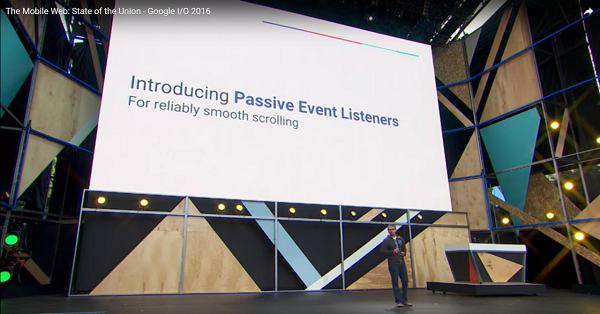
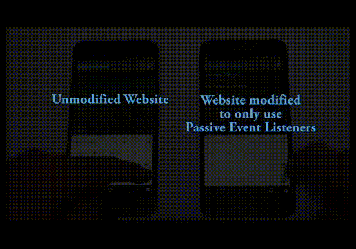
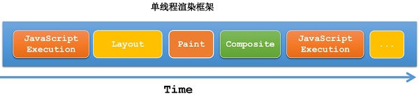
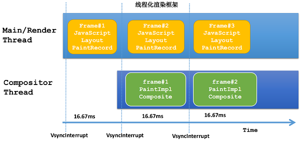
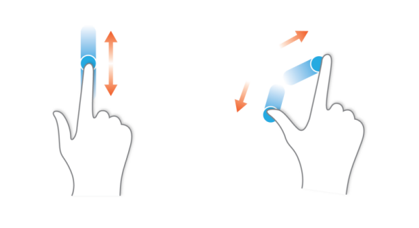
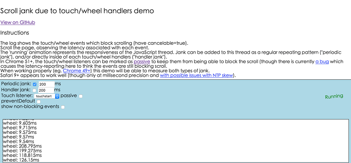
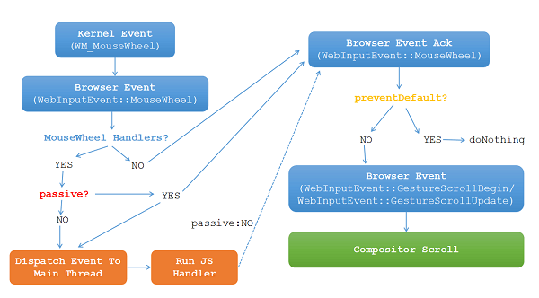

【**前言**】



在不久前的Google I/O 2016 [Mobile](https://so.csdn.net/so/search?q=Mobile&spm=1001.2101.3001.7020) Web Talk中，Google公布了一个让页面滑动更流畅的新特性Passive Event Listeners。该特性目前已经集成到Chrome51版本中。



上图为Chrome51上使用Passive Event Listener特性前后的效果对比图([原视频链接](https://www.youtube.com/watch?v=65VMej8n23A))。

从效果对比视频中可以明显看到，使用Passive Event Listeners特性后，页面的滑动流畅度相对使用之前提升了很多。

看完Passive Event Listeners特性这么给力的效果后，相信大部分童鞋脑海中都会产生以下几个问题：

**1. Passive Event Listeners是什么？** 
**2. 为什么需要Passive Event Listeners？** 
**3. Passive Event Listeners是怎么实现的？**

接下来，我们将围绕上面的这3个问题来深入理解Passive Event Listeners特性。

### Passive Event Listeners是什么？

Passive Event Listeners是Chrome提出的一个新的浏览器[特性](https://dom.spec.whatwg.org/)：Web开发者通过一个新的属性passive来告诉浏览器，当前页面内注册的事件监听器内部是否会调用preventDefault函数来阻止事件的默认行为，以便浏览器根据这个信息更好地做出决策来优化页面性能。当属性passive的值为true的时候，代表该监听器内部不会调用preventDefault函数来阻止默认滑动行为，Chrome浏览器称这类型的监听器为被动（passive）监听器。目前Chrome主要利用该特性来优化页面的滑动性能，所以Passive Event Listeners特性当前仅支持mousewheel/touch相关事件。

如下面的Html代码中，页面通过调用document.addEventListener来添加一个mousewheel事件的监听器handler，并通过设置passive属性的值为true来声明监听器handler是被动监听mousewheel事件，即handler内部不会调用事件的preventDefault函数。

```sql
function handler(e) { 
    doSomething(); // do something here
 }
document.addEventListener('mousewheel', handler, {passive: true});
```

### 为什么需要Passive Event Listeners特性？

Passive Event Listeners特性是为了提高页面的滑动流畅度而设计的，页面滑动流畅度的提升，直接影响到用户对这个页面最直观的感受。这个不难理解，想象一下你想要滑动某个页面浏览内容，当你用鼠标滚轮或者用手指触摸屏幕上下滑动的时候，页面并没有按你的预期进行滚动，此时你内心往往会感觉到一丝不爽，甚至想放弃该页面。Facebook之前做了一项试验，他们将页面滑动的响应刷新率从60FPS降低到30FPS的时候，发现用户的参与度急速下降。

由前面对Passive Event Listeners特性的介绍可知，Passive Event Listenrers特性是让Web开发者来告诉浏览器，当前页面内注册的mousewheel/touch事件监听器是否属于被动监听器，以便让浏览器更好地做决策来提高页面的滑动流畅度。那么Chrome浏览器为什么需要知道是否被动监听器这个信息呢？浏览器知道这个信息之后，它要做什么决策呢？要回答这个问题，有必要先了解一下目前Chrome浏览器的线程化渲染框架，它是Passive Event Listeners特性的基础。

在介绍Chrome浏览器的线程化渲染框架之前，我们先来简单了解本文涉及到的Chrome浏览器的一些概念。

1. 绘制（Paint）：将绘制操作转换成为图像的过程（比如软件模式下经过光栅化生成位图，硬件模式下经过光栅化生成纹理）。在Chrome中，绘制分为两部分实现：绘制操作记录部分（main-thread side）和绘制实现部分（impl-side）。绘制记录部分将绘制操作记录到SKPicture中，绘制实现部分负责将SKPicture进行光栅化转成图像；
2. 图层（Paint Layer）：在Chrome中，页面的绘制是分层绘制的，页面内容变化的时候，浏览器仅需要重新绘制内容变化的图层，没有变化的图层不需要重新绘制；
3. 合成（Composite）：将绘制好的图层图像混合在一起生成一张最终的图像显示在屏幕上的过程；
4. 渲染（Render）：可以简单认为渲染等价于绘制+合成；
5. UI线程（UI Thread）：浏览器的主线程，负责接收到系统派发给浏览器窗口的事件、资源下载等；
6. 内核线程（Main/Render Thread）：Blink内核及V8引擎运行的线程，如DOM树构建、元素布局、绘制（main-thread side）、JavaScript执行等逻辑在该线程中执行；
7. 合成线程（Compositor Thread）：负责图像合成的线程，如绘制（impl-side），合成等逻辑在该线程中执行。

OK，了解完上面的几个概念后，我们正式开始Chrome线程渲染框架的介绍。

### Chrome浏览器的线程化渲染框架

我们回顾一下传统的单线程渲染框架，如下图所示，内核线程几乎包揽了页面内容渲染的所有工作，如JavaScript执行，元素布局，图层绘制，图层图像合成等，每项工作的执行耗时基本都跟页面内容相关，耗时一般在几十毫秒至几百毫秒不等。



对于这种单线程渲染框架，存在两个明显的问题：

**1. 流水线的执行方式，后面的工作必须等待前面工作执行完成才能处理，无法将相互独立的工作并行处理；** 
**2. 内核线程负责的工作太多且耗时，一旦遇上内核在执行耗时较长的工作，用户的输入事件将无法立即得到响应。**

对于第1个问题，浏览器很难控制页面从内容变化到布局渲染整个过程的耗时（即新生成一帧内容的耗时），中间任何一项工作的执行都可能导致整体过程耗时变大，过大的耗时会导致页面内容的刷新率偏低，从而形成视觉上的卡顿。如浏览器收到VSync中断信号通知的时候，意味着页面需要立即对内容进行渲染，但这个时候内核线程可能还在执行一些业务的JavaScript代码，导致页面内容的渲染无法立即开始，如果页面无法在下一个VSync中断信号到来之前完成对内容的渲染，则页面会出现丢帧，即视觉体验上的卡顿。

> 注：VSync信号中断的频率，一般跟设备屏幕的刷新率对齐，比如设备的刷新率为60FPS（Frames Per Second），那么大概16.67ms会触发一下Vsync中断信号。Chrome浏览器和Android系统等都是通过VSync中断信号来通知页面启动内容的渲染（BeginFrame）。

对于第2个问题，由于内核线程负责的工作太多，这将导致内核线程经常处于忙碌状态，无法快速处理外界的输入消息，表现为用户操作了页面，但是无法立即得到响应。

为了优化第1个问题，Chrome浏览器对内核线程负责的工作进行拆分，通过多线程并发处理提高渲染效率减少丢帧，如内核线程仅负责DOM树构建、元素的布局、图层绘制记录部分（main-thread side）、JavaScript的执行，而图层绘制实现部分（impl-side）、图层图像合成则是交给合成线程负责处理。这种多线程负责页面内容的渲染框架，在Chrome中称为线程化渲染框架（Threaded Compositor Architecture）。



如上图所示，在Chrome的线程化渲染框架中，当内核线程完成第1帧（Frame#1）的布局和记录绘制操作，立即通知合成线程对第一帧（Frame#1）进行渲染，然后内核线程就开始准备第2帧（Frame#2）的布局和记录绘制操作。由此可以看出，内核线程在进行第N+1帧的布局和记录绘制操作同时，合成线程也在努力进行第N帧的渲染并交给屏幕展示，这里利用了CPU多核的特性进行并发处理，因此提高了页面的渲染效率。由此也可知，实际上用户看到的页面内容，是上一帧的内容快照，新的一帧还在处理中。

要优化第2个问题，对浏览器来说非常困难。只要输入事件要在内核线程执行逻辑，那么遇到内核线程在忙，必然无法立即得到响应。如用户的大部分输入事件都跟页面元素有关系，一旦页面元素注册了对应事件的监听器，监听器的逻辑代码（JavaScript）必须在内核线程中执行（V8引擎运行在内核线程），因此这种输入事件经常无法立即得到响应。

由上面的分析知道，用户的输入事件无法立即得到响应，是因为需要派发给内核线程处理。那有没有一些输入事件是可以不经过内核线程就能被快速处理的呢？答案是肯定的。



在Chrome中，这类可以不经过内核线程就能快速处理的输入事件为手势输入事件（滑动、捏合），手势输入事件是由用户连续的普通输入事件组合产生，如连续的mousewheel/touchmove事件可能会生成GestureScrollBegin/GestureScrollUpdate等手势事件。手势输入事件可以直接在已经渲染好的内容快照上操作，如滑动手势事件，直接对页面已经渲染好的内容快照进行滑动展示即可。由于线程化渲染框架的支持，手势输入事件可以不经过内核线程，直接由合成线程在内容快照上直接处理，所以即使此时内核线程在忙碌，用户的手势输入事件也可以马上得到响应。大家可以搞一个简单的demo验证一下Chrome浏览器的这个特性：如在一个有滚动条的页面内通过JavaScript执行一段死循环的代码(while-true之类的)，这个时候再去尝试上下滑动页面，你会发现此时页面仍能流畅地滑动。

由此可知，Chrome浏览器对于手势输入事件的响应是非常快的，因为它可以不需要经过内核线程，直接由合成线程快速处理。然而手势输入事件的产生可能需要内核线程，这会导致Chrome对手势输入事件的优化效果大打折扣。由前面介绍知道，手势输入事件是由连续的普通输入事件组成，而这些普通的输入事件可能会被对应的事件监听器内部调用preventDefault函数来阻止掉事件的默认行为，在这种场景下不会产生手势输入事件。如连续的mousewheel事件默认可以产生GestureScrollUpdate事件，但是如果监听器内部调用了preventDefault函数，那么这种情况下则不应该产生GestureScrollUpdate手势事件的。浏览器只有等内核线程执行到事件监听器对应的JavaScript代码时，才能知道内部是否会调用preventDefault函数来阻止事件的默认行为，所以浏览器本身是没有办法对这种场景进行优化的。这种场景下，用户的手势事件无法快速产生，会导致页面无法快速执行滑动逻辑，从而让用户感觉到页面卡顿。



而Chrome团队从统计数据中分析得出，注册了mousewheel/touch相关事件监听器的页面中，80%的页面内部都不会调用preventDefault函数来阻止事件的默认行为。对于这80%的页面，即使监听器内部什么都没有做，相对没有注册mousewheel/touch事件监听器的页面，在滑动流畅度上，有10%的页面增加至少100ms的延迟，1%的页面甚至增加500ms以上的延迟。Chrome团队认为对于统计中的这80%的页面来说，他们都是不希望因为注册mousewheel/touch相关事件监听器而导致滑动延迟增加的。点击[这里](https://rbyers.github.io/scroll-latency.html)可以体验页面注册后导致的滑动延迟，如上图。

如果能让Web开发者来明确告诉浏览器，监听器内部不会调用preventDefault函数来禁止默认的事件行为，那么浏览器将能快速生成手势输入事件，从而让页面响应更快。

介绍完这里，大家应该明白Chrome浏览器为什么需要Passive Event Listeners特性了。接下来，我们来看看Passive Event Listeners特性是怎么实现的。

### Passive Event Listeners的实现

```lua
function handler(event) {
    console.log(event.type); // log event type
}
document.addEventListener("mousewheel", handler, {passive:true});
```

为了更好地理解Passive Event Listeners特性，我们接下来了解一下它的实现过程。如上面代码所示，假定页面中注册了mousewheel事件的被动监听器，此时用户开始滑动鼠标滚轮来滑动页面。



如上图所述，用户的鼠标滚轮事件（`WM_MouseWheel`）由操作系统内核捕捉后，操作系统会将该事件派发给浏览器的UI线程处理。UI线程内部将系统的`WM_MouseWheel`事件转换为Chrome的`WebInputEvent::MouseWheel`事件后，接着通过IPC通道派发给合成线程的输入事件处理器处理。 
合成线程的输入事件处理器收到`WebInputEvent::MouseWheel`事件后，内部先会查询MouseWheel事件监听器的类型属性，然后根据监听器的类型属性值来进行不同逻辑的处理。

目前Chrome中监听器的类型属性值主要有四种：EventListenerProperties::kNone、EventListenerProperties::kPassive、EventListenerProperties::kBlocking、EventListenerProperties::kBlockingAndPassive，如下代码所述：

```kotlin
enum class EventListenerProperties {
  kNone,
  kPassive,
  kBlocking,
  kBlockingAndPassive,
  kMax
};
```

在Chrome中，kBlocking和kBlockingAndPassive类型属性的处理逻辑是一样的，这个不难理解，只要存在一个非passive类型的事件监听器，那么都有可能阻止事件的默认行为。接下来，我们了解一下不同类型属性监听器的实现逻辑。

**场景1：EventListenerProperties::kNone类型**

当事件监听器的类型属性为`EventListenerProperties::kNone`时，意味着当前页面内没有注册对应事件的监听器。对于这种场景（如上图中的`MouseWheel Handlers:No分支`），合成线程会马上发送一个MouseWheel的ACK消息给UI线程，UI线程收到MouseWheel的ACK消息后，会判断该事件是否被消费（Comsumed，即调用了preventDefault），如果已经被消费，则什么都不做。否则，UI线程会产生一个滑动手势事件（如果当前不是在滑动过程，手势事件为GestureScrollBegin，否则为GestureScrollUpdate），并滑动手势事件通过IPC通道派发给合成线程处理，合成线程收到该滑动手势事件之后，直接对内容快照进行滑动处理，并展示给到屏幕上。这种场景下，由于没有涉及到内核线程处理，用户的输入响应会非常及时。

**场景2：`EventListenerProperties::kBlockingAndPassive`或`cc::EventListenerProperties::kBlocking`类型**

当事件监听器的类型属性为`EventListenerProperties::kBlockingAndPassive`或`EventListenerProperties::kBlocking`时，意味着当前页面至少存在一个非passive类型的事件监听器。对应这种场景（如上图中的`MouseWheel Handlers:YES-Passive:No`分支），合成线程无法知道对应的监听器内部是否会调用preventDefault函数来阻止默认行为，此时合成线程只能将该输入事件派发给内核线程处理（Dispatch Event to Main Thread）。等内核线程执行完监听器的处理逻辑后（Run JS Handler），再发送一个MouseWheel的ACK消息给UI线程，UI线程收到Mouse Wheel的ACK消息后的处理逻辑跟场景1一致。这种场景下，手势输入事件必须等待事件监听器逻辑处理完成后才会产生并派发给合成线程处理，由于事件监听器逻辑的执行时机不确定，将非常容易导致用户的输入事件无法立即响应。

**场景3：`EventListenerProperties::kPassive`类型**

当事件监听器的类型属性为`EventListenerProperties::kPassive`时，意味着当前页面只存在passive类型的事件监听器。对于这种场景（如上图中的`MouseWheel Handlers:YES-Passive:YES`分支），合成线程首先会发送一个MouseWheel的ACK消息给UI线程，执行跟场景1中一样的逻辑，同时将该事件派发给内核线程处理，执行跟场景2相似的逻辑，但是在Run JS Handlers完成后，不会再发送Mouse Wheel事件的ACK消息。这种场景下，实际上是场景1和场景2的组合，两个场景是并行处理的，因此用户的MouseWheel输入事件能被立刻响应，也不会受到内核线程的事件监听器处理逻辑影响。

> 对于场景1和场景3的滑动，在Chrome中称为fast scroll模式，而场景2则称为slow scroll模式。

### 总结

经过上面的分析，我们了解到了Passive Event Listeners特性实际上是为了解决浏览器页面滑动流畅度而设计的，它通过扩展事件属性passive让Web开发者来告知浏览器监听器是否会阻止事件的默认行为，从而让浏览器可以更智能地决策并优化，这其中涉及到了Chrome的多线程渲染框架、输入事件处理等知识。