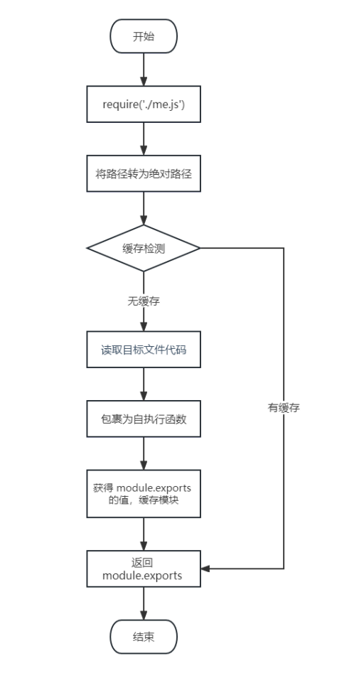

# require导入自定义模块的基本流程（这节好好理解理解）

这里我们介绍一下 require 导入 **自定义模块** 的基本流程：

- 将相对路径转为绝对路径，定位目标文件
- 缓存检测
- 读取目标文件代码
- 包裹为一个函数并执行（自执行函数）。通过 `arguments.callee.toString()` 查看自执行函数
- 缓存模块的值
- 返回 `module.exports` 的值



```js
// 伪代码
```

