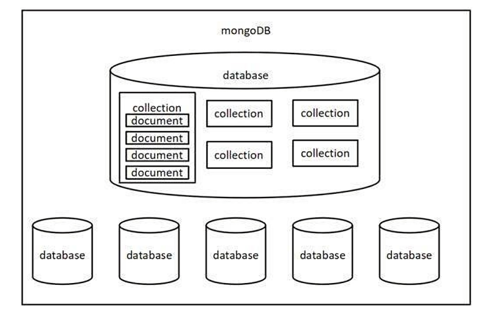

# MongoDB核心概念

Mongodb 中有三个重要概念需要掌握：

1. 数据库（database） 数据库是一个数据仓库，数据库服务下可以创建很多数据库，数据库中可以存放很多集合
2. 集合（collection） 集合类似于 JS 中的数组，在集合中可以存放很多文档
3. 文档（document） 文档是数据库中的最小单位，类似于 JS 中的对象



```js
{
"accounts": [
        {
            "id": "3-YLju5f3",
            "title": "买电脑",
            "time": "2023-02-08",
            "type": "-1",
            "account": "5500",
            "remarks": "为了上网课"
        },
        {
            "id": "3-YLju5f4",
            "title": "请女朋友吃饭",
            "time": "2023-02-08",
            "type": "-1",
            "account": "214",
            "remarks": "情人节聚餐"
        },
        {
            "id": "mRQiD4s3K",
            "title": "发工资",
            "time": "2023-02-19",
            "type": "1",
            "account": "4396",
            "remarks": "终于发工资啦!~~"
        }
    ],
    "users":[
        {
            "id": 1,
            "name": "zhangsan",
            "age": 18
        },
        {
            "id": 2,
            "name": "lisi",
            "age": 20
        },
        {
            "id": 3,
            "name": "wangwu",
            "age": 22
        }
    ]
}
```

大家可以通过 JSON 文件来理解 Mongodb 中的概念：

- 一个 `JSON 文件` 好比是一个 `数据库` ，一个 Mongodb 服务下可以有 `N` 个数据库
- JSON 文件中的 `一级属性的数组值` 好比是 `集合`
- 数组中的对象好比是 `文档`
- 对象中的属性有时也称之为 `字段`

一般情况下

- 一个项目使用一个数据库
- 一个集合会存储同一种类型的数据（比如一个集合存账单，一个集合存用户）
