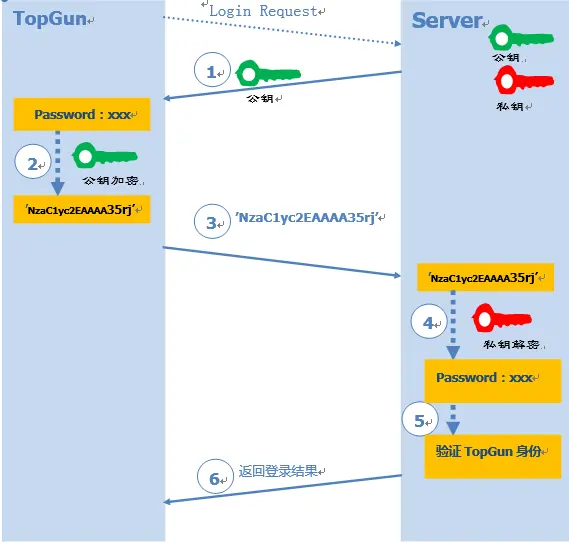
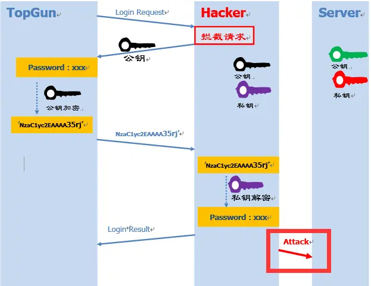
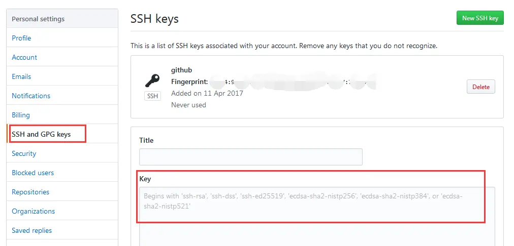
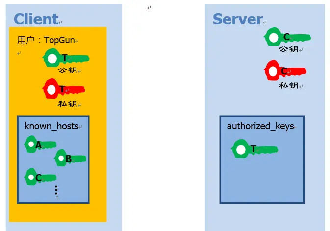

[原文链接](https://www.jianshu.com/p/33461b619d53)

# 图解SSH原理


主要内容

## 1. 初见SSH

[SSH](http://www.ietf.org/rfc/rfc4251.txt)是一种协议标准，其目的是实现**安全远程登录**以及其它**安全网络服务**。

> SSH仅仅是一**协议标准**，其具体的实现有很多，既有开源实现的OpenSSH，也有商业实现方案。使用范围最广泛的当然是开源实现OpenSSH。

## 2. SSH工作原理

在讨论SSH的原理和使用前，我们需要分析一个问题：**为什么需要SSH？**

从1.1节SSH的定义中可以看出，SSH和telnet、ftp等协议主要的区别在于**安全性**。这就引出下一个问题：**如何实现数据的安全呢？**首先想到的实现方案肯定是对数据进行**加密**。加密的方式主要有两种：

1. 对称加密（也称为秘钥加密）
2. 非对称加密（也称公钥加密）

所谓对称加密，指加密解密使用同一套秘钥。如下图所示：


图1-1：对称加密-Client端


图1-2：对称加密-Server端

对称加密的加密强度高，很难破解。但是在实际应用过程中不得不面临一个棘手的问题：**如何安全的保存密钥呢？**尤其是考虑到数量庞大的Client端，很难保证密钥不被泄露。一旦一个Client端的密钥被窃据，那么整个系统的安全性也就不复存在。为了解决这个问题，**非对称加密**应运而生。非对称加密有两个密钥：**“公钥”**和**“私钥”**。

> 两个密钥的特性：公钥加密后的密文，只能通过对应的私钥进行解密。而通过公钥推理出私钥的可能性微乎其微。

下面看下使用非对称加密方案的登录流程：



图1-3：非对称加密登录流程

1. 远程Server收到Client端用户TopGun的登录请求，Server把自己的公钥发给用户。
2. Client使用这个公钥，将密码进行加密。
3. Client将加密的密码发送给Server端。
4. 远程Server用自己的私钥，解密登录密码，然后验证其合法性。
5. 若验证结果，给Client相应的响应。

> 私钥是Server端独有，这就保证了Client的登录信息即使在网络传输过程中被窃据，也没有私钥进行解密，保证了数据的安全性，这充分利用了非对称加密的特性。

###### 这样就一定安全了吗？

上述流程会有一个问题：**Client端如何保证接受到的公钥就是目标Server端的？**，如果一个攻击者中途拦截Client的登录请求，向其发送自己的公钥，Client端用攻击者的公钥进行数据加密。攻击者接收到加密信息后再用自己的私钥进行解密，不就窃取了Client的登录信息了吗？这就是所谓的[中间人攻击](https://en.wikipedia.org/wiki/Man-in-the-middle_attack)



图1-4：中间人攻击

###### SSH中是如何解决这个问题的？

##### 1. 基于口令的认证

从上面的描述可以看出，问题就在于**如何对Server的公钥进行认证？**在https中可以通过CA来进行公证，可是SSH的**publish key**和**private key**都是自己生成的，没法公证。只能通过Client端自己对公钥进行确认。通常在第一次登录的时候，系统会出现下面提示信息：


```rust
The authenticity of host 'ssh-server.example.com (12.18.429.21)' can't be established.
RSA key fingerprint is 98:2e:d7:e0:de:9f:ac:67:28:c2:42:2d:37:16:58:4d.
Are you sure you want to continue connecting (yes/no)? 
```

上面的信息说的是：无法确认主机ssh-server.example.com（12.18.429.21）的真实性，不过知道它的公钥指纹，是否继续连接？

> 之所以用fingerprint代替key，主要是key过于长（RSA算法生成的公钥有1024位），很难直接比较。所以，对公钥进行hash生成一个128位的指纹，这样就方便比较了。

如果输入**yes**后，会出现下面信息：


```php
Warning: Permanently added 'ssh-server.example.com,12.18.429.21' (RSA) to the list of known hosts. 
Password: (enter password) 
```

该host已被确认，并被追加到文件**known_hosts**中，然后就需要输入密码，之后的流程就按照图1-3进行。

##### 2.基于公钥认证

在上面介绍的登录流程中可以发现，每次登录都需要输入密码，很麻烦。SSH提供了另外一种可以免去输入密码过程的登录方式：公钥登录。流程如下：


图1-5：公钥认证流程(2018-06更新)

1. ~~Client端用户TopGun将自己的公钥存放在Server上，追加在文件authorized_keys中。~~
2. ~~Server收到登录请求后，随机生成一个字符串str1，并发送给Client。~~
3. ~~Client用自己的私钥对字符串str1进行加密。~~
4. ~~将加密后字符串发送给Server。~~
5. ~~Server用之前存储的公钥进行解密，比较解密后的str2和str1。~~
6. ~~根据比较结果，返回客户端登陆结果。~~

## 上述流程有误，更正如下

1. Client将自己的公钥存放在Server上，追加在文件authorized_keys中。
2. Server端接收到Client的连接请求后，会在authorized_keys中匹配到Client的公钥pubKey，并生成随机数R，用Client的公钥对该随机数进行加密得到pubKey(R)
    ，然后将加密后信息发送给Client。
3. Client端通过私钥进行解密得到随机数R，然后对随机数R和本次会话的SessionKey利用MD5生成摘要Digest1，发送给Server端。
4. Server端会也会对R和SessionKey利用同样摘要算法生成Digest2。
5. Server端会最后比较Digest1和Digest2是否相同，完成认证过程。

> 在步骤1中，Client将自己的公钥存放在Server上。需要用户手动将公钥copy到server上。这就是在配置ssh的时候进程进行的操作。下图是GitHub上SSH keys设置视图：
>
> 
>
> GitHub中SSH keys设置

## 3. SSH实践

###### 生成密钥操作

经过上面的原理分析，下面三行命令的含义应该很容易理解了：


```ruby
$ ssh-keygen -t rsa -P '' -f ~/.ssh/id_rsa
$ cat ~/.ssh/id_rsa.pub >> ~/.ssh/authorized_keys
$ chmod 0600 ~/.ssh/authorized_keys
```

ssh-keygen是用于生产密钥的工具。

- -t：指定生成密钥类型（rsa、dsa、ecdsa等）
- -P：指定passphrase，用于确保私钥的安全
- -f：指定存放密钥的文件（公钥文件默认和私钥同目录下，不同的是，存放公钥的文件名需要加上后缀.pub）

首先看下面~/.ssh中的四个文件：


SSH-涉及文件

1. id_rsa：保存私钥
2. id_rsa.pub：保存公钥
3. authorized_keys：保存已授权的客户端公钥
4. known_hosts：保存已认证的远程主机ID（关于known_hosts详情，见文末更新内容）

四个角色的关系如下图所示：



SSH 结构简图

> 需要注意的是：一台主机可能既是Client，也是Server。所以会同时拥有authorized_keys和known_hosts。

###### 登录操作

```ruby
# 以用户名user，登录远程主机host
$ ssh user@host

# 本地用户和远程用户相同，则用户名可省去
$ ssh host

# SSH默认端口22，可以用参数p修改端口
$ ssh -p 2017 user@host
```

### 4 总结

本文以图文方式对SSH原理进行解析（主要指远程登录，没有涉及端口转发等功能）。同时分析了非对称加密的特性，以及在实践过程中如何对加密操作进行改进。

### 5.========== 持续更新 ==========

1. 感谢@[李白走天涯](https://www.jianshu.com/u/aee807abde90)、[Dargonfly429](https://www.jianshu.com/u/d83ea74c528b)的指正，图1.5中认证流程有误，下面是更正后的流程：

> Server端在authorized_keys中匹配到Client的公钥后，会生成随机数R，并用**Client的公钥对该随机数进行加密**，然后将加密后信息发送给Client，Client端通过私钥进行解密得到随机数R，然后对随机数R和本次会话的SessionKey利用MD5生成摘要Digest1，发送给Server端。Server端会也会对R和SessionKey利用同样摘要算法生成Digest2，最后比较Digest1和Digest2是否相同，完成认证过程。

1. 感谢 [Michael2397](https://www.jianshu.com/u/3335b8c6d402)评论，Client端的public key是Client手动Copy到Server端的，SSH建立连接过程中没有公钥的交换操作。另外图1.5还需要添加一点，Server端根据什么信息在authorized_keys中进行查找的呢？主要是根据Client在认证的开始会发送一个KeyID给Server，这个KeyID会唯一对应该Client的一个PublicKey，Server就是通过该KeyID在authorized_keys进行查找对应的PublicKey。

### ===========2018-08-02 更新================

感谢@[风笑天2013](https://www.jianshu.com/u/544d66f8c38a)指正，下面关于SSH的**known_hosts**机制做如下更正：

##### 1. known_hosts中存储的内容是什么？

known_hosts中存储是已认证的远程主机host key，每个SSH Server都有一个**secret, unique ID, called a host key**。

##### 2. host key何时加入known_hosts的？

当我们第一次通过SSH登录远程主机的时候，Client端会有如下提示：


```csharp
Host key not found from the list of known hosts.
Are you sure you want to continue connecting (yes/no)?
```

此时，如果我们选择**yes**，那么该host key就会被加入到Client的known_hosts中，格式如下：


```css
# domain name+encryption algorithm+host key
example.hostname.com ssh-rsa AAAAB4NzaC1yc2EAAAABIwAAAQEA。。。
```

##### 3. 为什么需要known_hosts？

最后探讨下为什么需要known_hosts，这个文件主要是通过Client和Server的双向认证，从而避免中间人（**man-in-the-middle attack**）攻击，每次Client向Server发起连接的时候，不仅仅Server要验证Client的合法性，Client同样也需要验证Server的身份，SSH client就是通过known_hosts中的host key来验证Server的身份的。

> 这中方案足够安全吗？当然不，比如第一次连接一个未知Server的时候，known_hosts还没有该Server的host key，这不也可能遭到**中间人**攻击吗？这可能只是安全性和可操作性之间的折中吧。

灰常感谢大家，希望收到更多的评论指正。